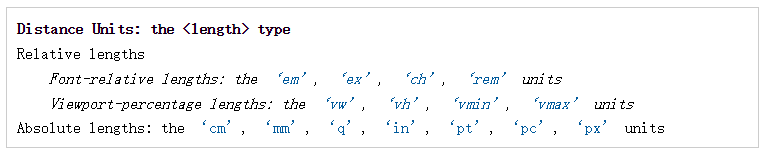

参考：

* [CSS Font-Size: em vs. px vs. pt vs. percent](http://kyleschaeffer.com/development/css-font-size-em-vs-px-vs-pt-vs/)
* [Em Vs Percent Widths](http://css-discuss.incutio.com/wiki/Em_Vs_Percent_Widths)
* [Using Points, Pixels, Ems, or Percentages for CSS Fonts](http://webdesign.about.com/cs/typemeasurements/a/aa042803a.htm)

<!--more-->


## px

对于px没有什么可以说的。

注："px 是一个相对单位"，这种说法是有问题的(毕竟说到相对都是相对于谁，px相对于谁呢)，因为px不相对于谁，只受平台dpi影响。[Units](https://www.w3.org/TR/css3-values/#lengths)

cm、pt之类的也都是绝对长度，但与px这个抽象单位不同的是它们都是物理单位，1pt则是1/72英寸，而1英寸换算到公制是2.54cm。 


## em

> em是一个相对单位，相对于『父辈元素』字体的单位，其真正的计算公式是：『1 ÷ 父元素的font-size × 需要转换的像素值 = em值』

### 历史

使用是"px"为单位是比较方便，而又一致，但在浏览器中放大或缩放浏览页面时会存在一个问题，要解决这个问题，我们可以使用"em"单位。[Richard Rutter](http://clagnut.com/about)'在[《How to size text using ems》](http://clagnut.com/blog/348/)一文中有做过详细的介绍，追至早一点，[Richard Rutter](http://clagnut.com/about)也在[《How to Size Text in CSS》](http://alistapart.com/article/howtosizetextincss)中进行过深入的剖析。

### 技术要点

这种技术需要一个参考点，一般都是以`<body>`的`font-size`为基准。比如说我们使用`1em=10px`来重置默认值`1em=16px`，这样一来，我们设置字体大小`14px`时，只需要将其值设置为`1.4em`。

注：任意浏览器的默认字号都是16px。所以未经调整的浏览器都符合:`1em=16px`。那么`12px=0.75em`, `10px=0.625em`。为了简化`font-size`的换算，需将`body`声明为`font-size=62.5%`，这就使`body`的默认字号变为：`16px*62.5%=10px`，这样`1em=10px`，`1.2em=12px`。

这样之后 1em = 10px 在布局等使用的时候好换算了很多，如想想将你网站所有的px改为em，也就是说只需要将你的原来的px数值除以10，然后换上em作为单位就行了。

```CSS
# 10 ÷ 16 × 100% = 62.5%
body{
    font-size: 62.5%;
}

# 2.4em × 10 = 24px
h1{
    font-size: 2.4em;
}

# 1.4em × 10 = 14px
p{
    font-size: 1.4em;
}
```

"1.4em"可以是"14px",也可以是"20px"，或者说是"24px"，总之是一个不确定值，怎么确定这个值的大小呢，要么你知道其父元素的值，要么在任何子元素中都使用"1em"，这样就会追溯到最顶层父辈元素。


## Percent

Em is always relative to font size. % is relative to the containing block, usually the body, a div, or a table, unless applied to font-size, in which case it applies to the parent font-size.

### 相对于谁

首先要明确百分比是相对于谁，宽泛的讲是父元素，但是并不是十分准确

* 对于普通定位元素就是我们理解的父元素
* 对于position: absolute;的元素是相对于已定位的父元素（offset parent）
* 对于position: fixed;的元素是相对于 ViewPort
* viewport：可视窗口，也就是浏览器的window那么大

意外

*padding、margin 如果设置了百分比，会发现左右和预期一样，用的父元素宽度的百分比，但是用的也是 ** 宽度 ** 百分比，而不是想象中的高度的百分比
*后代元素继承的是百分比 计算后的值 ，而不是原百分比，这个对于line-height的时候经常会遇到坑，还有这样的面试题问你line-height设置为120%和1.2的区别


## rem

CSS3引入了新的单位rem —— "font size of the root element" 。

引入它是为了解决，"em"是相对于其父辈元素字体大小，依赖追溯困难，带来不可预知的问题。而rem是相对于根元素`<html>`，依赖简单，只需要在根元素确定一个参考值。

在根元素中设置多大的字体：

```CSS
# 10 ÷ 16 × 100% = 62.5%
html{
    font-size:62.5%;
}

# 1.4 × 10px = 14px
body{
    font-size:1.4rem;
}

# 2.4 × 10px = 24px
h1{
    font-size:2.4rem;
}
```

注：虽然em、rem，base于font-size，但是并不单单只能应用于font-size。

### rem使用场景

rem可用来做移动端的适配，屏幕尺寸联动`html`的`font-size`，而`html`的`font-size`联动所有的子元素rem，这样就做到了适配。

原理：给`html`元素定义一个字体大小，来作为整个页面的参考值(base变量值)。网页的全部**文本、元素宽高、间距**都用`rem`来设置大小，再结合这个**base变量**，就可以做到只修改这个base值，联动所有rem值，因为它们都是base的倍数。

Eg：视觉稿是按照iPhone6的宽度来设计的，即375px，那么，可以完全按照视觉稿，用px在1:1的比例下还原，比如视觉稿上的尺寸是80px，那么在css中就可以直接定义`width:80px`，页面中所有的尺寸都这样来设置。

当所有的网站所有的页面样式都设置好之后，我们需要做两件事情：

* 设置rem base值大小，即html font-size值
* px转为rem


## vw、vh

vw是CSS3引入的单位，相对于视口的宽度，视口被均分为100单位的vw，1vw = 1%窗口宽度。vh同理。


## 总结

各个单位都有各个单位的优缺点，不要单纯的认为px、em、rem、perent哪个好，这取决于场景，不能脱离场景谈应用。例如，em、rem、perent这些相对单位，比较适合做尺寸联动适配

所有的em、rem、percent渲染的时候，都会被转为px，因为**px是计算机矢量图渲染成像的原理**。
