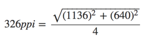

要搞懂移动端的适配问题，搞明白`像素`和`视口`很重要。


## 像素

问题：在移动端给一个元素设置`width:200px`时发生了什么？这里的`px`到底是多长？

像素是网页布局的基础，但是我们一直在用视觉使用它。其实存在两种像素：

* 物理像素(physical pixel)
* 设备独立像素(density-independent pixel)

<!--more-->

### 物理像素(physical pixel)

一个物理像素是显示器(手机屏幕)上最小的物理显示单元，在操作系统的调度下，每一个设备像素都有自己的颜色值和亮度值。

以iPhone5为例，我们已知的是(注意这里使用的都是物理像素)：

* 分辨率：`1136px x 640px`指屏幕上垂直有1136个物理像素，水平有640个物理像素；
* 屏幕尺寸：`4英寸`指屏幕对角线的长度；
* 屏幕像素密度/解析度：`326dpi`指屏幕像素密度(Dot Per Inch)单位dpi，表示屏幕水平或垂直每英寸有326个物理像素。原则上讲，dpi越高越好，图像会更加细腻清晰；

ppi是可以通过**分辨率**和**屏幕尺寸**计算得到的：



### 设备独立像素(density-independent pixel)

设备独立像素(也叫密度无关像素)，简称为`dips`，单位是`dp`，可以认为是计算机坐标系统中得一个点，这个点代表一个可以由程序使用的虚拟像素(比如: CSS像素 -- CSS中使用的一个抽象的概念，单位是`px`)，然后由相关系统转换为物理像素。

那么，回到前面的问题，一个元素`width:200px`以后，这个元素跨域了200个CSS像素，200个CSS像素相当于多少个物理像素取决于两个条件：

* 页面是否缩放；
* 屏幕是否为高密度(Ratina)；

所以说，物理像素和设备独立像素之间存在着一定的对应关系，在排除页面缩放的情况下，他们的对应关系取决于设备像素比。

### 设备像素比(device pixel ratio)

除了缩放，**屏幕是否为高密度**也会影响设备像素和CSS像素的关系。

在缩放程度为100%(这个条件很重要，因为缩放也会影响他们)时，他们的比例叫做**设备像素比**(device pixel ratio)：

> 设备像素比(dpr) = 物理像素 / 设备独立像素   # 在某一方向上，x方向或者y方向

注：在JS中：window.devicePixelRatio，在css中，可以通过-webkit-device-pixel-ratio，-webkit-min-device-pixel-ratio和  -webkit-max-device-pixel-ratio进行媒体查询，对不同dpr的设备，做一些样式适配(这里只针对webkit内核的浏览器和webview)

### Retina屏

https://www.zhihu.com/question/24258580
https://www.zhihu.com/question/20752006
http://www.html-js.com/article/Mobile-terminal-H5-mobile-terminal-HD-multi-screen-adaptation-scheme%203041

普通屏幕的设备像素比为1，Retina屏幕会比较大，一般是2倍(对应的面积就是4倍 -- 长宽各乘2)。

Eg：一个960px宽的网站，在MacBook Retina上如果才能保证一样的浏览效果？
直接显示成960 x 2 = 1920px宽，才可以保证屏幕显示的物理大小。
所以你在Retina上看是200px，在一般电脑只会显示成100px，否则一般电脑屏幕看上去就比设计大一倍了。


## 视口

桌面浏览器中，浏览器窗口就是约束你的CSS布局视口(又称初始包含块)。它是所有CSS百分比宽度推算的根源，它的作用是给CSS布局限制了一个最大宽度，视口的宽度和浏览器窗口宽度一致。

但是在移动端，情况就很复杂了。

### Layout Viewport(布局视口)

一个没有为移动端优化的网页，会尽可能缩小网页让用户看到所有东西。下面是在魅族note2(1920 * 1080)中看leke的样子，你也可以在Chrome移动开发模式下看到。


注：上面可以看出页面x轴没有出现滚动条，由此可以大概知道，note2的默认layout viewport大概在1000px+(因为leke index 的grid是1000px)。

浏览器厂商为了让用户在小屏幕下网页也能够显示地很好，所以把视口宽度设置地很大，一般在 768px ~ 1024px 之间，最常见的宽度是 980px。

所以，在手机上，视口与移动端浏览器屏幕宽度不再相关联，是完全独立的，这个浏览器厂商定的视口被称为**布局视口**。


layout viewport我们是看不见的，只知道网页的最大宽度是默认的layout viewport宽度，并且被缩放在了屏幕内。

可以这样设置布局视口的宽度：

```HTML
<meta name="viewport" content="width=640">
```

**媒体查询与布局视口**

```HTML
@media (min-width:700px) {
    ...
}
```

这里的700指的是layout viewport的宽度。

注：document.documentElement.clientWidth/Height返回布局视口的尺寸。

### Visual Viewport(视觉视口)

**视觉视口**是用户正在看到的网页的区域，大小是屏幕中CSS像素的数量。


注：window.innerWidth/Height返回视觉视口的尺寸。

### Idea Viewport(理想视口)

布局视口明显对用户是不友好的，完全忽略了手机本身的尺寸。所以苹果引入了理想视口的概念，它是**对设备来说最理想的布局视口尺寸**。理想视口中的网页用户最理想的宽度，用户进入页面的时候不需要缩放。

现在讨论所谓的『最理想的宽度』到底是多少？其实，如果我们把布局视口的宽度改成屏幕的宽度不就不用缩放了么。可以这样设置告诉浏览器使用它的理想视口：

```HTML
<meta name="viewport" content="width=device-width">
```

`screen.width/height`返回理想视口的尺寸，不过有兼容性问题 --- 可能返回两种值：理想视口尺寸、屏幕的设备像素尺寸。


## 缩放

### 缩放与设备像素、CSS像素的关系

缩放是在放大或缩小CSS像素，比如一个宽度为200px的元素无论怎么放大，还是200个CSS像素。但是因为这些像素被放到了，所以CSS像素也就跨越了更多的设备像素。缩小则相反。

### 缩放与视口

缩放会影响视觉视口的尺寸：

页面被用户放大，视觉视口内CSS像素数量减少；被用户缩小，视觉视口内CSS像素数量增多就行了。

用户缩放不会影响布局视口：

注意，这是[用户缩放]，后面会说开发者设置缩放的情况。

### 缩放比例

xxx

### 禁止缩放

```HTML
<meta name="viewport" content="user-scalable=no">
```

### 设置缩放

```HTML
<meta name="viewport" content="initial-scale=2">
```

使用`initial-scale`有一个副作用：同时也会将布局视口的尺寸设置为缩放后的尺寸。所以`initial-scale=1`与`width=device-width`的效果是一样的。

注：不缩放又要求放进visual layout里，所以`initial-scale=1`与`width=device-width`等同。


## 完美视口

解决各种浏览器兼容问题的理想视口设置：

```HTML
<meta name="viewport" content="width=device-width,initial-scale=1">
```


## 总结

这一篇介绍了移动端适配需要掌握的知识，先说明了移动端存在的两个像素，然后介绍了三种视口，由缩放对视口的影响引入理想视口，最后说明设备像素比，下一篇介绍现在市面上的适配方案。
