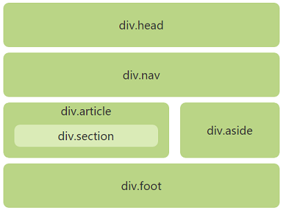
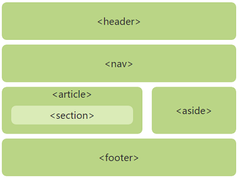

HTML5 中加入了很多新的内容，包括：

```
* Semantic
* 属性：自定义属性 -- data-xxx；全局属性 -- placeholder、...
* 新的 input 类型
```

```
* WebSocket
* Web Storage
* Blob（File）
* FormData
* FileReader
* XHR2（xhr.responseType = "blob";）
* ...
```

<!--more-->

## 标签和属性

### DOCTYPE

DOCTYPE 是一个带历史包袱的标签，反应了 HTML 技术的发展。

`<!DOCTYPE>` 标签位于文档中的最前面的位置，作用相当于一个标识符，此标签可告知parser(排版引擎)使用哪种 `HTML` 或 `XHTML` 解析规则，和使用哪种渲染模式。

```
DOCTYPE的基本结构：<!DOCTYPE Element-name DTD-type DTD-name DTD-url>
HTML5：<!DOCTYPE Element-name>
```

* `<!DOCTYPE>` 是关键字，表示声明 DTD；
* `Element-name` 指定该 DTD 的根元素名称；
* `DTD-type` 指定该 DTD 是属于标准公用的还是私人定制的。若是 `PUBLIC` 则表示该 DTD 是标准公用的，如果设为 SYSTEM 则表示是私人定制的；
* `DTD-name` 指定该 DTD 的文件名称；
* `DTD-url` 指定该 DTD 文件所在的 URL 网址；

#### DTD

参考：

* [xhtml1-strict](http://www.w3.org/TR/XHTML1/DTD/XHTML1-strict.dtd)

 DTD 是一份规则，会被 DOCTYPE 标签所声明引用，老版本的 parser 会根据 DTD-name 来选择对应的解析规则（到底是4s、4t...）。现代浏览器 HTML5 规则下的 parser，无需指定 DTD，且向下兼容。

`DTD`的种类：

```HTML
<!-- XHTML1.0/HTML4.01 transitional -->
!!!xt/!!!4t
<!-- XHTML1.0/HTML4.01 strict -->
!!!xs/!!!4s
<!-- XHTML1.0/HTML4.01 frameset -->
!!!xf/!!!4f

<!-- XHTML 1.1 -->
!!!xxs

<!-- HTML5 -->
!!!
```

例如，XHTML1.0 strict：

```HTML
<!DOCTYPE HTML PUBLIC "-//W3C//DTD XHTML 1.0 Strict//EN" "http://www.w3.org/TR/XHTML1/DTD/XHTML1-strict.dtd">
```

在上面的声明中，声明了文档的根元素是`HTML`，它在公共标识符被定义为`“-//W3C//DTD XHTML 1.0 Strict//EN”`，浏览器将明白如何寻找匹配此公共标识符的`DTD`。

HTML5 的 Doctype 没有对 DTD 进行引用。原因：

* HTML5 不是基于 SGML 的，DTD 是 SGML 里概念，所以 HTML5 没有 DTD；
* 现代浏览器的 parser 都按照 HTML5 规范编写，HTML5 兼容所有的老版本 HTML，语法非常包容。主张开发规范由开发者自定义，而不是由 parser 强制校验；

#### Quirks model、Almost standards model、Standard model

DOCTYPE 这个标签，侧面反映了互联网发展，从独尊儒术，到百家争鸣。

parser 会根据 DOCTYPE 来选择不同的渲染模式，来正确显示网页。

```HTML
<!-- 省略 DTD-name 和 DTD-url -->
<!DOCTYPE html PUBLIC>
<!-- 省略 DTD-url -->
<!DOCTYPE html PUBLIC "-//W3C//DTD XHTML 1.0 Strict//EN">
```

```JavaScript
document.compatMode;        // CSS1Compat、BackCompat
```

省略了DTD-name的DOCTYPE声明是无效的，因为它包含公共标识符关键字PUBLIC，却没有公共标识符(指示所用HTML版本的名称)，这将会触发怪异模式，而省略了DTD-url的DOCTYPE照常进入Standards Model。

注：触发Quirks model方式有哪些？

### 新增结构化语义标签



`header`、`footer`、`nav`、`hgroup`、`section`、`article`、`aside`、`figure`、`figcaption`。

注：`hgroup`（标题组合）（在HTML5.1中被废除，因为W3C不建议用h1-h6来描述副标题）

```HTML
<hgroup>
    <h1>主标题</h1>
    <h2>副标题</h2>
</hgroup>
```

### 新增的表单类型

`email`、`url`、`number`、`range`、`Date Pickers(date、month、week、time、datetime、datetime-local)`、`search`、`color`。

### 新增的多媒体标签

`video`、`audio`、`embed`。

### 新增的其他功能标签

`command`、`progress`、`time`、`canvas`、`details`、`datalist`、`dialog`、`ruby`、`rt`、`rp`、`wbr`、`keygen`、`output`、`mark`、`meter`。

### 新增的全局属性

`contenteditable`、`contextmenu`、`draggable`、`dropzone`、`spellcheck`、`hidden`、`data-*`

### 废除的标签和属性

* 废除的标签：

```
* 可用css代替的标签：`basefont`、`big`、`center`、`font`、`strike`、`tt`，这些纯表现的元素；   
* 不再使用frame：包括`frame`、`noframes`、`frameset`。HTML5中不支持frame框架，只支持iframe框架；   
* 其他：acronym(用abbr代替)、applet(用object代替)、dir(ul代替)；   
```

* 废除的属性：

```
* `align`、`bgcolor`、`height`、`width`、`valign`、`hspace`、`vspace`、body标签上的`link、vlink、align、text`、iframe元素上的`scrolling`、table上的`cellpadding、cellspacing、border`。
```

注意：现代浏览器 HTML5 规范下的 parser 非常包容（兼容所有的 HTML4 和 XHTML），上述标签由于语义或者性能上原因被废除，这只是在规范上被废除（不建议使用），但不代表 parser 不能被正确解析。要不然含有这些标签 `!!!xt/!!!4t` 的代码，无法在 HTML5 parser 下运行。

### 结构化语义标签兼容处理

```CSS
article,aside,details,figcaption,figure,footer,header,hgroup,nav,section{display:block;}
mark{background:#ff0; color:#000;}
```

```JavaScript
<!--[if lt IE 9]>
<script type="text/javascript">
var elements = 'article,aside,details,figcaption,figure,footer,header,hgroup,nav,section,mark'.split(',');

var i = 0;
while(i < elements.length) {
    document.createElement(elements[i]);
    i ++;
}
</script>
<![endif]-->
```

或者：

```JavaScript
<!--[if lt IE 9]>
<script type="text/javascript">
'section header nav aside article footer figure figcaption'.replace(/\w+/g, function (n) { 
    document.createElement(n) 
});
</script>
<![endif]-->
```

或者：

```HTML
<!--[if lt IE 9]>
<script src="http://html5shiv.googlecode.com/svn/trunk/html5.js"></script> 
![endif]-->
```

注：已上 JS 代码必须添加在页面的 head 标签内，因为 IE 浏览器必须在元素解析前知道这个元素。


## JavaScript
